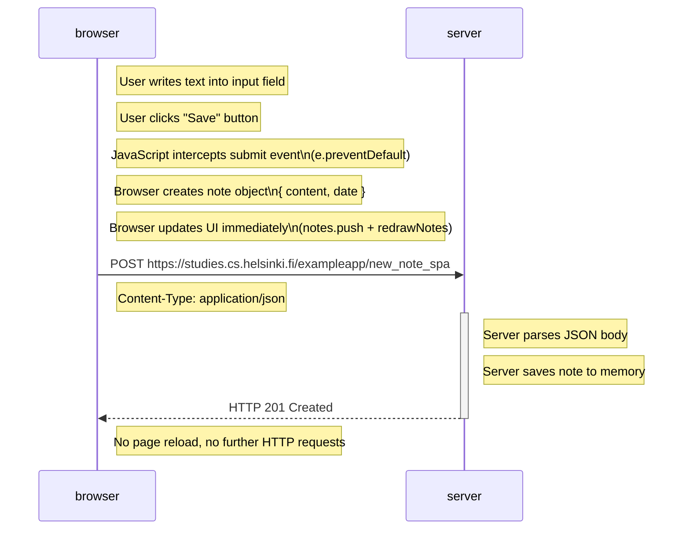

```mermaid
sequenceDiagram
    participant browser
    participant server

    Note right of browser: User writes text into input field

    Note right of browser: User clicks "Save" button

    Note right of browser: JavaScript intercepts submit event\n(e.preventDefault)

    Note right of browser: Browser creates note object\n{ content, date }

    Note right of browser: Browser updates UI immediately\n(notes.push + redrawNotes)

    browser->>server: POST https://studies.cs.helsinki.fi/exampleapp/new_note_spa
    Note right of browser: Content-Type: application/json
    activate server
    Note right of server: Server parses JSON body
    Note right of server: Server saves note to memory
    server-->>browser: HTTP 201 Created
    deactivate server

    Note right of browser: No page reload, no further HTTP requests

```