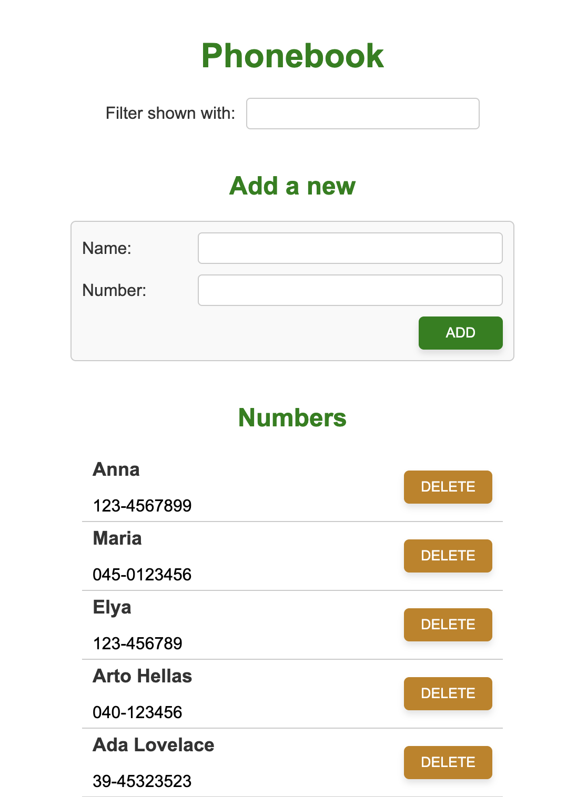

# 📞 Phonebook Backend – Full Stack Open (Part 3)

This project is my backend implementation for the **“Phonebook Backend”** assignment [Full Stack Open – Part 3](https://fullstackopen.com/en/part3).

It provides a REST API for storing, retrieving, updating, and deleting phonebook entries.
The backend is built with Node.js, Express, and MongoDB (via Mongoose).



### Deployed version:

[https://fullstack-open-course-zqns.onrender.com](https://fullstack-open-course-zqns.onrender.com)


---

## 🚀 Features
- Full CRUD API for managing contacts
- MongoDB database with validation rules
- Custom error handling (CastError, ValidationError)
- Morgan logging with request body support
- Serves the frontend build from /dist
- Environment variable support via .env
- Deployed to Render (production-ready)

---

## 🗂️ Project Structure
```
part3/phonebook-backend/
├── dist/                 # Production-ready frontend (served statically by Express)
│   └── ...              
│
├── models/
│   └── person.js         # Mongoose schema, field validation, custom toJSON
│
├── .env                  # Local environment variables (MONGODB_URI, PORT)
├── .gitignore            # Git ignore rules
├── eslint.config.mjs     # ESLint configuration
│
├── index.js              # Express server, API routes, middleware, logging, error handling
├── mongo.js              # CLI script for listing/adding persons in MongoDB
│
├── package.json          # Project metadata, dependencies, scripts
├── package-lock.json     # Dependency lockfile
│
└── README.md             # Project documentation
```
---
## 📝 How It Works
### 📌 Database
The app connects to MongoDB using:
```bash
process.env.MONGODB_URI
```
The `Person` schema includes:

- **Name**
	- minimum length: 3
	- only letters + spaces

- **Number**
	- at least 8 characters
	- format: `XX-XXXXXXX` or `XXX-XXXXXXX`

### 📌 API Endpoints

| Method |      Endpoint      | Description |
|--------|--------------------|-------------|
| GET    | `/api/persons`     | Get all persons |
| GET    | `/api/persons/:id` | Get person by ID |
| POST   | `/api/persons `    | Add new person |
| PUT    | `/api/persons/:id` | Update person |
| DELETE | `/api/persons/:id` | Delete person |

### 📌 Error Handling

The backend handles:

- Invalid IDs → malformatted id

- Mongoose validation errors

- Missing fields

- Already removed records

### 📌 Logging

Morgan logs include the body of POST requests:
```bash
:method :url :status :res[content-length] - :response-time ms :body
```

## 💻 Running the Backend Locally

1. Clone the repository
```bash
git clone https://github.com/Kopiika/fullstack_open_course.git
cd part3/phonebook-backend
```
2. Install dependencies
```bash
npm install
```
3. Create .env
```bash
MONGODB_URI=your_mongodb_connection_string
PORT=3001
```
4. Start the backend
```bash
npm start
```

**API will be available at:**
```bash
http://localhost:3001/api/persons
```

## 🌐 Deployment (Render)
To deploy on Render:

1. Create a new Web Service

2. Connect your GitHub repo

3. Add Environment Variable:
```bash
MONGODB_URI=your_real_atlas_url
```
4. Choose:

	- Build command: npm install

	- Start command: npm start

Render logs help verify database connection status.

## 🛠️ Development Tools
This backend uses:

- ESLint for linting

- nodemon during development

- Morgan for logging

- Mongoose for schema validation

Run lint:
```bash
npm run lint
```

---
## 🌱 Challenges I Faced

Working on the backend taught me:

- How to structure an Express server with routing and middleware

- How to build validated schemas in Mongoose

- How to use custom error handlers

- How to deploy and debug backend issues on Render

- Common connection problems with MONGODB_URI

- How to serve a React build from an Express backend

This part significantly improved my understanding of backend architecture and working with databases.

## 📜 License

This project is part of the Full Stack Open course exercises and is intended for learning purposes only.


