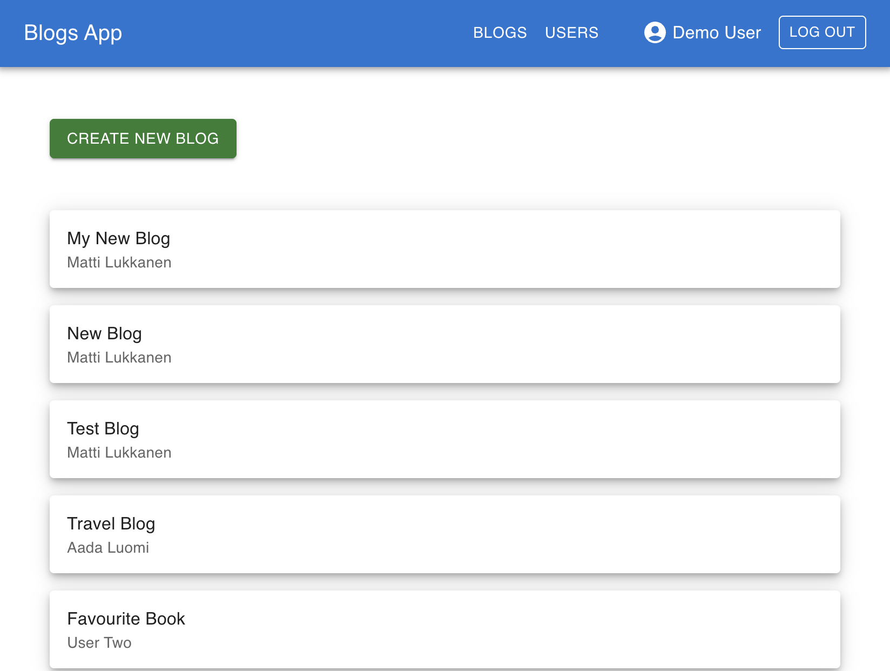
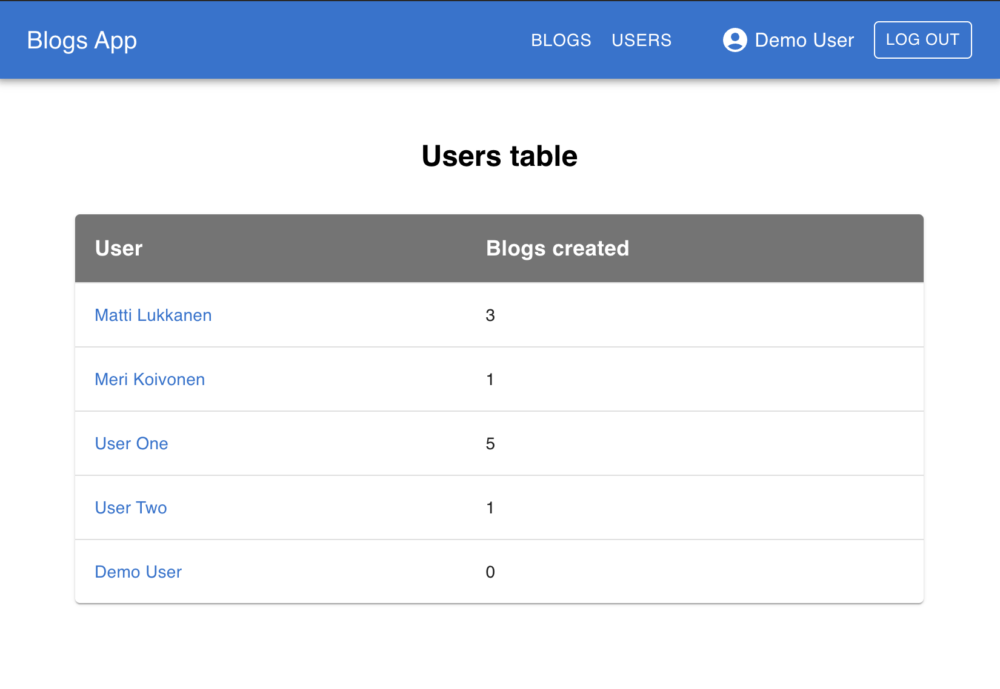

# Blog List Backend – Full Stack Open (Part 7)

This is the extended **Blog List** backend used as the API for the Part 7 frontend.
It builds on the Part 4 backend by adding **comments support** and a **testing reset endpoint** for end-to-end test isolation.

It provides a **REST API** for managing blogs, users, authentication, and comments.
The backend is built with **Node.js**, **Express**, **MongoDB** (via **Mongoose**), and uses Node's built-in test runner.





Deployed version:
[https://bloglist-app-l0mi.onrender.com](https://bloglist-app-l0mi.onrender.com)

You can use demo account:
```bash 
username: demo
password: demopassword123
```

---

## 🚀 Features
- REST API for blogs and users

- User registration & login with JWT authentication

- Password hashing with bcrypt

- Blog ownership & authorization (only creator can delete a blog)

- Default values (e.g. likes = 0)

- Proper error handling for invalid data and unauthorized actions

- Fully tested backend (unit & integration tests)

- Environment-based configuration (test / development / production)

---

## Project Structure

```
bloglist-backend/
├── controllers/
│   ├── blogs.js           # Blog CRUD routes + comments endpoint
│   ├── users.js           # User creation routes
│   ├── login.js           # Authentication routes
│   └── testing.js         # Reset endpoint for test isolation
│
├── models/
│   ├── blog.js            # Blog schema (title, author, url, likes, comments, user)
│   └── user.js            # User schema (username, name, passwordHash, blogs)
│
├── utils/
│   ├── config.js          # Environment variable handling
│   ├── logger.js          # Logging utilities
│   └── middleware.js      # Token extractor, error handler, unknown endpoint
│
├── tests/
│   ├── blog_api.test.js   # Blog API integration tests
│   ├── user_api.test.js   # User API integration tests
│   ├── list_helper.test.js# Unit tests for helper functions
│   ├── average.test.js    # Unit tests for average helper
│   ├── reverse.test.js    # Unit tests for reverse helper
│   └── test_helper.js     # Shared test helpers and initial data
│
├── app.js                 # Express app configuration
├── index.js               # Entry point
│
├── .env                   # Environment variables (not committed)
├── eslint.config.mjs
├── package.json
├── package-lock.json
└── README.md
```
---

## How It Works

### Database

The backend connects to **MongoDB** via Mongoose. Required environment variables:

```bash
MONGODB_URI=your_mongodb_connection_string
TEST_MONGODB_URI=your_test_database_url
SECRET=your_jwt_secret
PORT=3003
```

### Schemas

- **Blog** — `title` (required), `author`, `url` (required), `likes` (default: 0), `comments` (array of strings), `user` (ref to User)
- **User** — `username` (unique, required), `name`, `passwordHash`, `blogs` (array of refs)

### API Endpoints

**Blogs**

| Method | Endpoint              | Description                        |
|--------|-----------------------|------------------------------------|
| GET    | `/api/blogs`          | Get all blogs (populated with user)|
| POST   | `/api/blogs`          | Create a blog (auth required)      |
| PUT    | `/api/blogs/:id`      | Update blog likes                  |
| DELETE | `/api/blogs/:id`      | Delete blog (only owner)           |
| POST   | `/api/blogs/:id/comments` | Add a comment to a blog       |

**Users**

| Method | Endpoint     | Description      |
|--------|--------------|------------------|
| GET    | `/api/users` | Get all users    |
| POST   | `/api/users` | Create new user  |

**Authentication**

| Method | Endpoint    | Description              |
|--------|-------------|--------------------------|
| POST   | `/api/login`| Login and receive JWT    |

**Testing (only in `NODE_ENV=test`)**

| Method | Endpoint        | Description                              |
|--------|-----------------|------------------------------------------|
| POST   | `/api/testing/reset` | Clears the database for test isolation |

### Testing

Unit and integration tests run using Node’s built-in test runner and Supertest.

Run tests:

```bash
npm test
```

Tests run against a **separate test database** (`TEST_MONGODB_URI`) to keep data isolated.

---

## Running Locally

1. Install dependencies:

```bash
npm install
```

2. Create a `.env` file in the project root:

```bash
MONGODB_URI=your_mongodb_connection_string
TEST_MONGODB_URI=your_test_database_url
SECRET=your_jwt_secret
PORT=3003
```

3. Start the server in development mode:

```bash
npm run dev
```

API available at: `http://localhost:3003/api/blogs`

To run in test mode (enables the `/api/testing/reset` endpoint):

```bash
npm run start:test
```

---

## Development Tools

- **Express 5** – web framework
- **Mongoose** – MongoDB ODM
- **bcrypt** – password hashing
- **jsonwebtoken** – JWT authentication
- **Supertest** – HTTP integration testing
- **Node test runner** – built-in test framework (no Jest)
- **ESLint** – linting

Run lint:

```bash
npm run lint
```

---

## Challenges I Faced

Working on this project helped me understand:

- How to extend an existing REST API with new endpoints (comments) without breaking existing consumers
- Adding a `testing` controller that is only mounted in `NODE_ENV=test` to safely reset state
- Switching from Jest to Node’s built-in test runner and adapting test syntax
- Keeping population and `toJSON` transformations consistent as the schema grew
- Structuring authorization so only blog owners can delete their own blogs

---

## License

This project is part of the **Full Stack Open course** exercises and is intended for **learning purposes only**.


