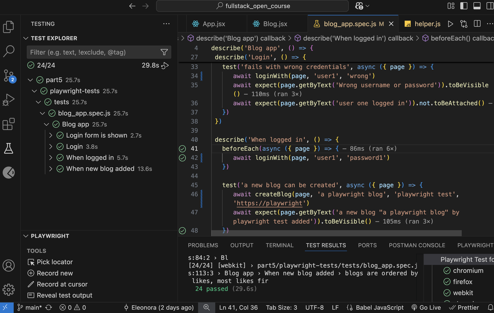

# 📝 Blog List Frontend – Full Stack Open (Part 5)

This project is the **frontend implementation** of the Blog List application for  
[Full Stack Open – Part 5](https://fullstackopen.com/en/part5).

The application allows users to log in, view blogs, create new blogs, like existing ones, and delete blogs they own.

### 🔗 Related Projects

- **Backend (REST API)**
  Located in **Part 4**:
  👉 https://github.com/Kopiika/fullstack_open_course/tree/main/part4/bloglist-backend

- **End-to-End Tests (Playwright)**
  Located in **Part 5**:
  👉 https://github.com/Kopiika/fullstack_open_course/tree/main/part5/playwright-tests

The frontend communicates with the backend using token-based authentication, and the full user flow is tested using Playwright.

---

## 🚀 Features

- User login with JWT authentication
- Persistent login using browser storage
- Create, like, and delete blogs
- Conditional UI rendering based on user authentication
- Fully tested React components

---

## 🗂️ Project Structure

```
part5/bloglist-frontend/
├── src/
│   ├── components/
│   │   ├── Blog.jsx
│   │   ├── Blog.module.css             # styles
│   │   ├── Blog.test.jsx               # test
│   │   ├── BlogForm.jsx
│   │   ├── BlogForm.module.css         # styles
│   │   ├── BlogForm.test.jsx           # test
│   │   ├── LoginForm.jsx
│   │   ├── LoginForm.module.css        # styles
│   │   ├── Notification.jsx
│   │   ├── Notification.module.css     # styles
│   │   └── Togglable.jsx
│   │
│   ├── services/
│   │   ├── blogs.js        # Blog API requests
│   │   └── login.js        # Login API requests
│   │
│   ├── App.jsx
│   ├── App.module.css
│   ├── main.jsx
│   └── index.css
│
├── eslint.config.js
├── vite.config.js
├── index.html
├── package-lock.json
├── package.json
├── testSetup.json
└── README.md

```

---

### 🧪 Testing

This frontend includes **component and integration tests** using:

- Jest

- React Testing Library

- user-event

**Tested Scenarios**

- Blog rendering behavior

- Conditional display of blog details

- Blog creation form submission

- Login form functionality

- Event handler calls (e.g. likes, submit)

Labels were added to form fields to improve accessibility and make tests more reliable.

Run tests:

```bash
npm test
```

### 📸 Test Results

The screenshot below shows successfully executed end-to-end tests using Playwright:



## 🔐 Authentication Flow

1. User logs in via the frontend

2. Credentials are sent to bloglist-backend

3. Backend returns a JWT token

4. Token is stored in browser storage

5. Token is attached to API requests

6. UI updates based on authentication state

### 💻 Running Locally

```bash
npm install
npm run dev
```

⚠️ Make sure the backend is running:
👉 part4/bloglist-backend

## 🛠️ Development Tools

- React 19

- Vite

- ESLint (new config format)

- Jest & React Testing Library

---

## 🌱 Challenges I Faced

- Connecting frontend to a separately developed backend

- Managing authentication state across reloads

- Testing components that rely on API calls

- Mocking backend services in unit tests

- Writing accessible markup to improve test reliability

This part strengthened my understanding of **frontend testing**, **authentication**, and **full-stack integration**.

## 📜 License

This project is part of the **Full Stack Open course** exercises and is intended for **learning purposes only**.
